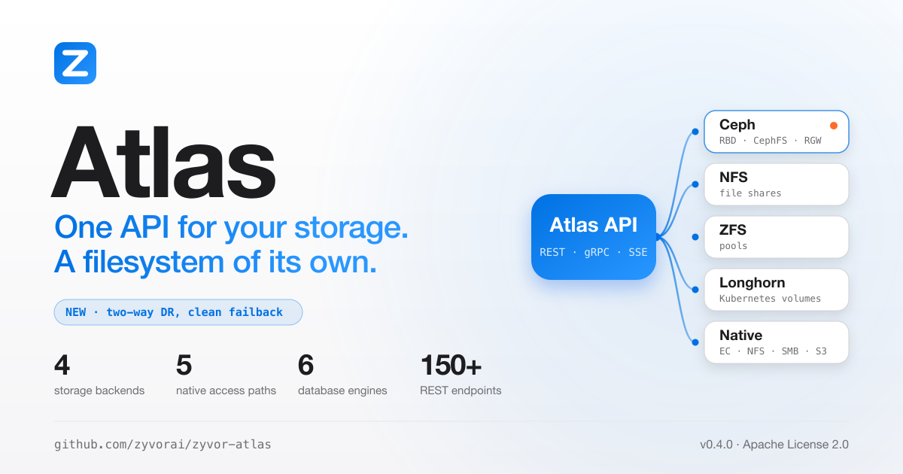
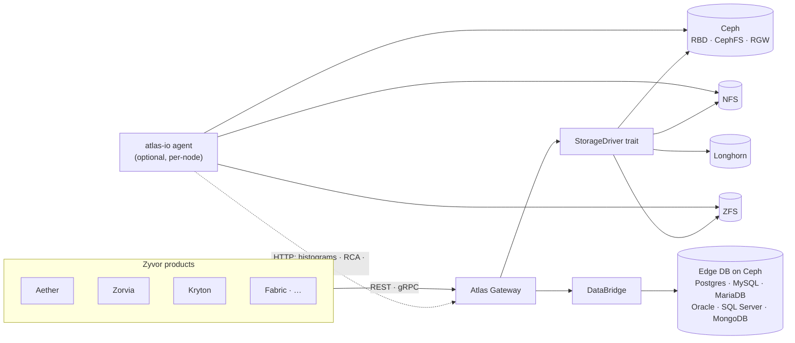

<!-- Copyright (c) 2026 ZyvorAI Labs Private Limited. -->
<!-- SPDX-License-Identifier: Apache-2.0 -->
<div align="center">

<picture>
  <source media="(prefers-color-scheme: dark)" srcset="docs/social/atlas-share-card-dark.png">
  
</picture>

# Atlas

### The world of storage, under one command.

The **central storage control plane** for the Zyvor suite.<br>
Products call stable Atlas APIs; Atlas maps intent to Ceph, NFS, ZFS and Longhorn through pluggable drivers. Object storage defaults to Ceph RGW; any S3-compatible endpoint is usable via the generic RGW client.

[](https://github.com/zyvorai/atlas/actions/workflows/ci.yml)
[](LICENSE)
[](CHANGELOG.md)
[](https://zyvorai.github.io/atlas/)

[**Quickstart**](#quickstart) · [**Capabilities**](#capabilities) · [**Docs**](#documentation) · [**Gallery**](#dashboard-gallery) · [**Architecture**](#architecture-at-a-glance) · [**Contributing**](#contributing) · [**License**](#license)

<sub>Rust · React · TypeScript · SQLite · gRPC · Ceph</sub>

</div>

---

**4** storage backends · **6** database engines migratable via DataBridge · **80+** REST endpoints · **3** access surfaces (REST · gRPC · SSE) · **eBPF** observe-first I/O sensor

A gateway with an Apple Shop console for operators. Read the [full docs](https://zyvorai.github.io/atlas/): quickstart, architecture, licensing.

<div align="center">

<picture>
  <source media="(prefers-color-scheme: dark)" srcset="docs/ux/night-00-overview.png">
  
</picture>

</div>

## Quickstart

```bash
make run
# Console → http://127.0.0.1:5110
cargo run -p atlasctl -- --base-url http://127.0.0.1:5110 health
```

No Ceph cluster needed to try it — `make run` starts the gateway against a fake driver so
you can click through the whole console immediately.

Deploy to a remote k3s host:

```bash
./scripts/deploy-remote.sh <host> <user>
# UI → http://<host>:30510
```

| Track | Where |
| --- | --- |
| **Source, issues, releases** (Apache License 2.0) | This repo |
| **Project / contact** | [https://zyvor.dev](https://zyvor.dev) |
| **Docs site** | https://zyvorai.github.io/atlas/ |

More: [docs/GETTING_STARTED.md](docs/GETTING_STARTED.md) · [docs/DEPLOYMENT.md](docs/DEPLOYMENT.md) · [docs/ARCHITECTURE.md](docs/ARCHITECTURE.md).

## Capabilities

<table>
<tr>
<td valign="top" width="33%">
<b>Intent to storage</b><br>
Volumes, snapshots, clones, CephFS RWX and S3 buckets via REST + gRPC. Ceph RGW is the default object backend.
</td>
<td valign="top" width="33%">
<b>Pluggable drivers</b><br>
Real Ceph first; NFS, ZFS and Longhorn; a fake driver for the local demo. Generic S3 via <code>atlas-driver-rgw</code>.
</td>
<td valign="top" width="33%">
<b>DataBridge</b><br>
Cloud-to-edge DB migration (six engines, CDC, cutover) on Ceph.
</td>
</tr>
<tr>
<td valign="top" width="33%">
<b>Day-2</b><br>
Alerts, maintenance, governance, quotas, upgrade preflight, DR scaffolding.
</td>
<td valign="top" width="33%">
<b>Ops Advisor</b><br>
Explainable AI-assisted risk scoring and prioritized, read-only runbooks.
</td>
<td valign="top" width="33%">
<b>Console</b><br>
Apple.com-style top-nav shell, SF type, Night/Day themes.
</td>
</tr>
<tr>
<td valign="top" width="33%">
<b>atlas-io (eBPF sensor)</b><br>
Optional, observe-first I/O agent: device-attributed histograms, workload/RCA, fail-open leases — kept out of the gateway so it never needs <code>CAP_BPF</code>.
</td>
<td valign="top" width="33%">
<b>Observability</b><br>
Prometheus <code>/metrics</code>, forecast/history, OpenTelemetry tracing, unified <code>/events</code>, deep readyz/livez.
</td>
<td valign="top" width="33%">
<b>Governance & security</b><br>
Per-tenant quotas, DB-backed rate limiting, OIDC/SSO, Vault-backed secrets, token revocation.
</td>
</tr>
</table>

Customer-facing feature guide: [docs/atlas-customer-feature-guide.md](docs/atlas-customer-feature-guide.md).

## Dashboard gallery

Live console shots (captured against a lab deployment), Day theme shown; the overview above follows your light/dark setting.

<table>
<tr>
<td width="33%"><br><sub>Volumes</sub></td>
<td width="33%"><br><sub>Observatory</sub></td>
<td width="33%"><br><sub>Ceph</sub></td>
</tr>
<tr>
<td width="33%"><br><sub>DataBridge</sub></td>
<td width="33%"><br><sub>Alerts</sub></td>
<td width="33%"><br><sub>Jobs</sub></td>
</tr>
</table>

Full tour: [Gallery](https://zyvorai.github.io/atlas/gallery).

## Architecture at a glance



Full write-up: [docs/ARCHITECTURE.md](docs/ARCHITECTURE.md).

## Documentation

| For | Start at |
|---|---|
| Engineers evaluating or building on Atlas | **[docs/README.md](docs/README.md)** — architecture, API reference, drivers, day-2 ops, DataBridge, AI Advisor, the `atlas-io` eBPF sensor |
| Operators running the console day to day | **[docs/customer/README.md](docs/customer/README.md)** — getting started, admin basics, per-page reference |
| A single narrative read of everything the product does | **[docs/atlas-customer-feature-guide.md](docs/atlas-customer-feature-guide.md)** |
| Published docs site | [zyvorai.github.io/atlas](https://zyvorai.github.io/atlas/) |

## Why Atlas

| | Atlas | Raw Ceph tooling | Rook alone |
|---|---|---|---|
| Intent-based API (not pool internals) | Yes | No | No |
| One API across Ceph + NFS + ZFS | Yes | Ceph only | Ceph only |
| Cloud-to-edge DB migration (DataBridge) | Yes | No | No |
| Per-tenant quotas & governance | Yes | Partial | No |
| Built-in operator console | Yes | Ceph Dashboard only | No |
| Kubernetes-native provisioning | Yes (via drivers) | No | Yes |
| eBPF I/O observability, kept out of the control plane | Yes (`atlas-io`) | No | No |

## Important boundaries

Atlas is Apache-2.0 software: use, modify and redistribute it, including in production and in commercial
products, under the terms of the license ([full guide](docs/LICENSING.md)). Boundaries that are about
maturity, not licensing, live in [docs/STATUS.md](docs/STATUS.md): what is verified on real infrastructure,
and what is lab-verified only.

## Contributing

Read [CONTRIBUTING.md](CONTRIBUTING.md) for conventions and how to add an endpoint, driver, or
migration. Contributions are made under the [CLA](CLA.md), signed off per the
[DCO](DCO.md) (`git commit -s`), and governed by our [Code of Conduct](CODE_OF_CONDUCT.md).
Found a security issue? See [SECURITY.md](SECURITY.md) rather than opening a public issue.

## License

Commercial subscriptions and support: see [docs/SUBSCRIPTION-MODEL.md](docs/SUBSCRIPTION-MODEL.md).

Licensed under the **[Apache License, Version 2.0](LICENSE)**. See [docs/LICENSING.md](docs/LICENSING.md)
and [NOTICE](NOTICE).

<div align="center">

<sub>Star history</sub>

[](https://star-history.com/#zyvorai/atlas&Date)

</div>
