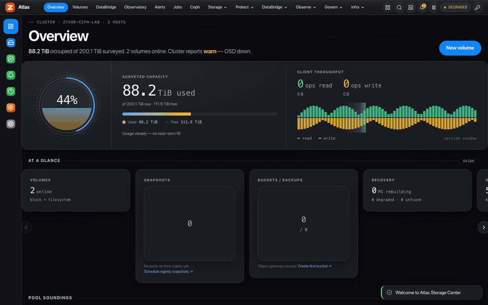
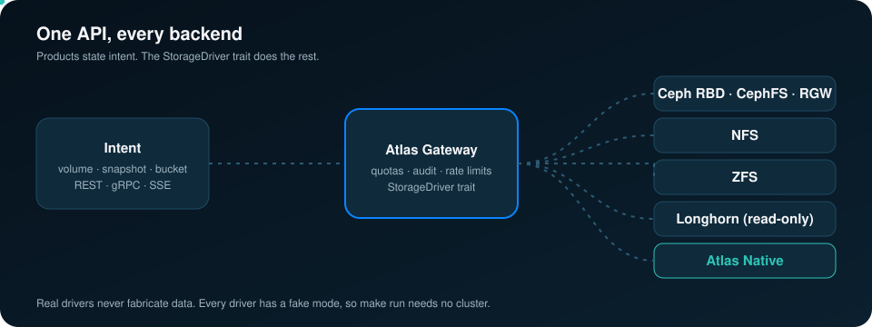
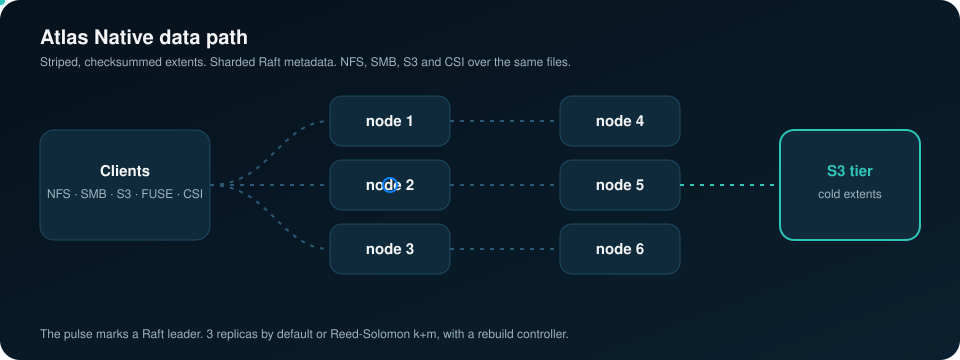

<!-- Copyright (c) 2026 ZyvorAI Labs Private Limited. -->
<!-- SPDX-License-Identifier: Apache-2.0 -->
<div align="center">

# Atlas

**One API for the storage you have. A filesystem for the storage you need.**

[](https://github.com/zyvorai/zyvor-atlas/actions/workflows/ci.yml)
[](LICENSE)
[](CHANGELOG.md)
[](Cargo.toml)
[](https://zyvorai.github.io/zyvor-atlas/)

[](https://zyvor.dev/schedule?utm_source=github&utm_medium=atlas&utm_campaign=readme_hero)
[](https://zyvor.dev/poc?utm_source=github&utm_medium=atlas&utm_campaign=readme_hero)
[](https://zyvorai.github.io/zyvor-atlas/)




**Atlas is two things in one Apache-2.0 platform.** A **control plane** that maps volume, snapshot and bucket intent to Ceph, NFS, ZFS and Longhorn through pluggable drivers. And **Atlas Native**, a distributed filesystem with its own data path: striped and erasure-coded extents, sharded Raft metadata, NFS, SMB and S3 gateways, replication to a second site, and a single-node edge profile.

**4 backends + Native** · **150+ REST endpoints** · **REST · gRPC · SSE** · **Two-way DR, clean failback** · **6 DB engines in DataBridge**

[**Quickstart**](#quickstart) · [**Docs**](https://zyvorai.github.io/zyvor-atlas/) · [**Architecture**](docs/ARCHITECTURE.md) · [**API**](docs/API.md) · [**DR**](docs/DR.md) · [**Status**](docs/STATUS.md) · [**Comparison**](docs/COMPARISON.md)

</div>

---

## Why teams pick Atlas

| When this happens… | Atlas gives you… |
|---|---|
| Every product talks to Ceph pools, NFS exports and ZFS datasets its own way | One intent API (volumes, snapshots, clones, CephFS RWX, S3 buckets) over REST and gRPC |
| You need a scale-out filesystem but not another vendor's appliance | Atlas Native: your own nodes, Raft metadata, erasure coding, NFS/SMB/S3/CSI, under Apache-2.0 |
| A second site exists, but nobody trusts the failback | Two-way RBD mirroring and native replication, with a promote guard and a status endpoint that says when it is safe |
| Edge sites have one small box and no storage team | The Native edge profile: one pod, small caches, replication or snapshot export back to the core |
| Tenants share storage with no guardrails | Per-tenant quotas, rate limiting, OIDC/SSO, Vault-backed secrets and token revocation |
| Databases must move from the cloud to the edge | DataBridge: discovery, full load, CDC and cutover onto edge databases on Ceph |
| You want to try it without a storage cluster | `make run` starts the gateway against a fake driver so you can click through the whole console |


---

## One API, every backend



Products call stable Atlas APIs, and the `StorageDriver` trait maps the intent to a backend. Drivers cover Ceph (RBD, CephFS, RGW), NFS, ZFS, read-only Longhorn and Atlas Native, each with fake and real modes; real drivers never fabricate data. Around it: **DataBridge** cloud-to-edge database migration, **Day 2** operations (alerts, maintenance, upgrade preflight, quotas, audit export), and a read-only **Ops Advisor** that scores risk and plans capacity, also exposed as MCP tools. [Architecture →](docs/ARCHITECTURE.md)

## Run the filesystem yourself



Atlas Native is a distributed filesystem Atlas runs itself: striped, checksummed, copy-on-write extents with direct client reads and `io_uring` on raw devices; the namespace sharded across Raft groups; 3 replicas or Reed-Solomon k+m with a rebuild controller; cold extents tiered to S3; POSIX over FUSE, NFS, SMB, S3 and a Kubernetes CSI driver; quotas, POSIX ACLs and a single-node edge profile. [Native storage →](docs/NATIVE_STORAGE.md)

## Fail over, fail back cleanly



`GET /dr/mirrors/{id}/status` shows each site's live `rbd mirror image status` and whether a promote would be clean. Atlas refuses a non-forced promote until the local `rbd-mirror` has replayed the peer's demotion, and `?force=1` stays available for real disasters. Native clusters get asynchronous replication with read-only replicas, promote and demote. [DR guide →](docs/DR.md) · [Native replication →](docs/NATIVE_REPLICATION.md)

---

## Proof, not promises

Everything below ran on real infrastructure in the Atlas lab. Lab verification is not production support ([STATUS.md](docs/STATUS.md)).

- **Two-way RBD mirroring** between two Rook Ceph clusters, clean failback, unsafe promote refused, checksums matched at every step ([DR.md](docs/DR.md)).
- **Edge profile:** catalog memory flat at about 26 MB from 200k to 400k files, where defaults reach about 196 MB ([NATIVE_EDGE.md](docs/NATIVE_EDGE.md)).
- **Erasure coding:** about 1.5 GiB/s encode and 2 GiB/s two-shard rebuild per core on 4 MiB extents ([NATIVE_STORAGE.md](docs/NATIVE_STORAGE.md)).
- **NFS, SMB, S3 and CSI on Native** verified with real clients and a single-node k3s ([NATIVE_NFS.md](docs/NATIVE_NFS.md)).
- **DataBridge** through CDC and cutover for six source engines ([DATABRIDGE.md](docs/DATABRIDGE.md)).

**Not yet:** NVMe and RDMA benchmark numbers, an IO500 submission, GPUDirect Storage, and cross-site mirroring of RBD consistency groups. See [COMPARISON.md](docs/COMPARISON.md).

---

## Atlas vs Rook alone, and vs WEKA

| | **Atlas** | **Rook alone** |
|---|---|---|
| What it is | Storage control plane with drivers per backend, plus its own filesystem | Kubernetes operator that runs Ceph |
| Interface for products | Intent-based REST, gRPC and SSE APIs | Kubernetes custom resources and CSI PVCs |
| Backends | Ceph, NFS, ZFS, Longhorn, Atlas Native, generic S3 | Ceph |
| Cross-site DR | Two-way RBD mirroring with a guarded failback; native replication | RBD mirroring CRDs |
| Database migration | DataBridge (discovery, full load, CDC, cutover) | Not in scope |
| **Choose Rook alone when** | | You only run Ceph inside Kubernetes and its own dashboard and CRDs are enough |

Compared with a parallel filesystem such as WEKA, including where WEKA is the better choice today: [docs/COMPARISON.md](docs/COMPARISON.md).

## The console

<div align="center">
<picture>
  <source media="(prefers-color-scheme: dark)" srcset="docs/ux/night-00-overview.png">
  
</picture>
</div>

<table>
<tr>
<td width="33%"><br><sub>Volumes</sub></td>
<td width="33%"><br><sub>Observatory</sub></td>
<td width="33%"><br><sub>DataBridge</sub></td>
</tr>
</table>

Full tour: [Gallery](https://zyvorai.github.io/zyvor-atlas/gallery). Screenshots come from a lab deployment.

## Quickstart

```bash
make run          # gateway with a fake driver, no Ceph needed
# Console: http://127.0.0.1:5110
```

Atlas Native on Kubernetes: `helm upgrade --install atlas-native deploy/helm/atlas-native -n atlas-native --create-namespace`, or add `-f deploy/helm/atlas-native/values-edge.yaml` for a one-pod edge site. More: [Getting started](docs/GETTING_STARTED.md) · [Deployment](docs/DEPLOYMENT.md) · [Native FS](docs/NATIVE_FS.md) · [Chart values](deploy/helm/atlas-native/README.md).

## What it is, and is not

Atlas is Apache-2.0 software you can use in production and in commercial products ([licensing](docs/LICENSING.md)). What is verified where, and what is lab-only (including the experimental live eBPF attach), is in [docs/STATUS.md](docs/STATUS.md). History: [CHANGELOG.md](CHANGELOG.md).

## Part of the Zyvor stack

**[Aether](https://github.com/zyvorai/Aether)** runtime portability plane · **[Zorvia](https://github.com/zyvorai/zyvor-zorvia)** KubeVirt VM platform · **[Kryton](https://github.com/zyvorai/zyvor-kryton)** · **[Transiva](https://github.com/zyvorai/zyvor-transiva)** VM migration · [zyvor.dev](https://zyvor.dev)

## License and support

Free and open source under the [Apache License 2.0](LICENSE) ([NOTICE](NOTICE)). **Zyvor Enterprise** adds supported releases, deployment and upgrade guidance, priority incident triage, a named technical contact and 24x7 critical intake: [plans](docs/SUBSCRIPTION-MODEL.md) · [pricing](https://zyvor.dev/pricing?utm_source=github&utm_medium=atlas&utm_campaign=readme_license) · [sales@zyvor.dev](mailto:sales@zyvor.dev).

Contributing: [CONTRIBUTING.md](CONTRIBUTING.md), under the [CLA](CLA.md) and [DCO](DCO.md) (`git commit -s`), governed by the [Code of Conduct](CODE_OF_CONDUCT.md). Security issues: [SECURITY.md](SECURITY.md).

<div align="center">

### Put every storage backend behind one API, and run the filesystem yourself

[](https://zyvor.dev/schedule?utm_source=github&utm_medium=atlas&utm_campaign=readme_footer)
[](https://zyvor.dev/poc?utm_source=github&utm_medium=atlas&utm_campaign=readme_footer)
[](https://zyvor.dev/pricing?utm_source=github&utm_medium=atlas&utm_campaign=readme_footer)
[](mailto:sales@zyvor.dev?subject=Atlas)
[](https://github.com/zyvorai/zyvor-atlas)

</div>
