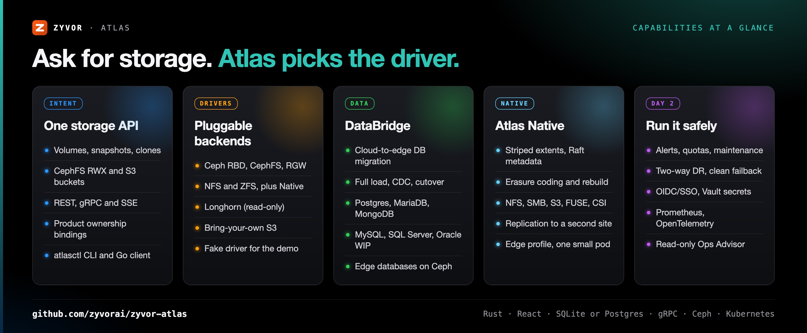
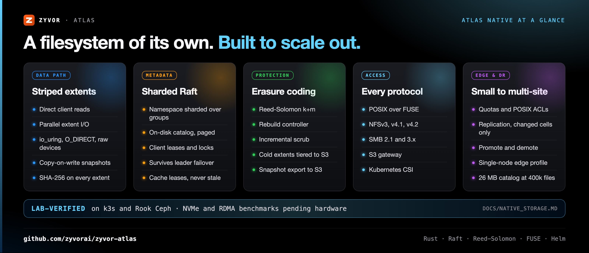
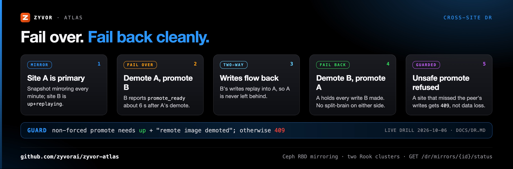
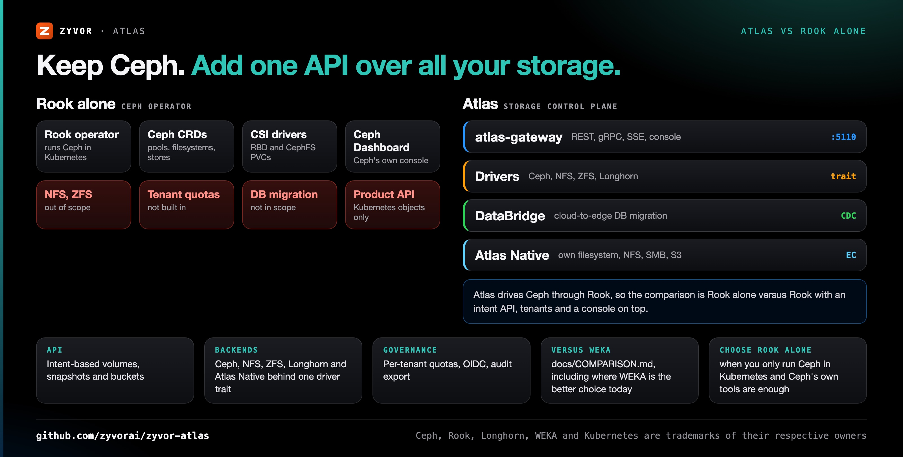
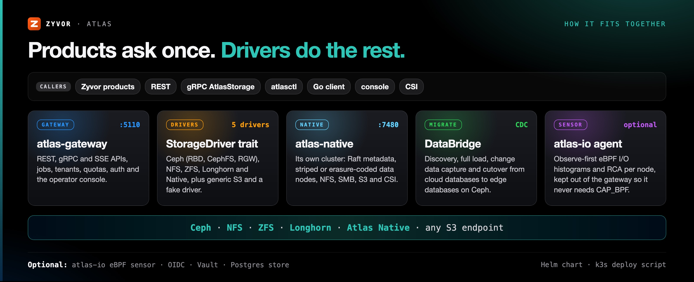
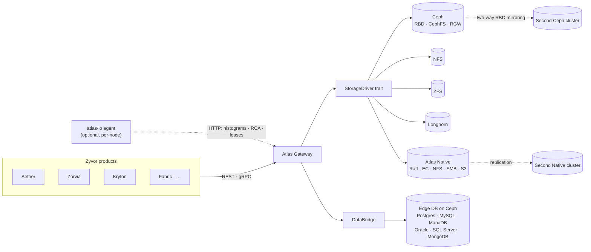

<!-- Copyright (c) 2026 ZyvorAI Labs Private Limited. -->
<!-- SPDX-License-Identifier: Apache-2.0 -->
<div align="center">

# Atlas

[](https://github.com/zyvorai/zyvor-atlas/actions/workflows/ci.yml)
[](LICENSE)
[](CHANGELOG.md)
[](Cargo.toml)
[](https://zyvorai.github.io/zyvor-atlas/)

[](https://zyvor.dev/schedule?utm_source=github&utm_medium=atlas&utm_campaign=readme_hero)
[](https://zyvor.dev/poc?utm_source=github&utm_medium=atlas&utm_campaign=readme_hero)
[](#quickstart)


### One API for the storage you have. A filesystem for the storage you need.

**Atlas is two things in one Apache-2.0 platform.** A **control plane** that maps volume, snapshot and bucket intent to Ceph, NFS, ZFS and Longhorn through pluggable drivers. And **Atlas Native**, a distributed filesystem with its own data path: striped and erasure-coded extents, sharded Raft metadata, NFS, SMB and S3 gateways, replication to a second site, and a single-node edge profile.

**4 backends + Native** · **150+ REST endpoints** · **REST · gRPC · SSE** · **Two-way DR, clean failback** · **6 DB engines in DataBridge**

<sub>Rust · React · TypeScript · SQLite or Postgres · gRPC · Ceph · Kubernetes</sub>

📖 **[Read the full docs](https://zyvorai.github.io/zyvor-atlas/)**: quickstart, architecture, API reference, and what is verified where.

</div>

---

## What's new

| | |
|---|---|
| **Two-way DR with clean failback** | RBD mirroring in both directions between two Ceph clusters. A non-forced promote is refused until this site has replayed the peer's demotion, so a failback can't silently lose writes. Verified live on 2026-10-06 ([DR.md](docs/DR.md)) |
| **Native replication** | Asynchronous filesystem replication to a second Atlas Native cluster: snapshot increments that send only changed extents, a read-only replica, promote and demote ([NATIVE_REPLICATION.md](docs/NATIVE_REPLICATION.md)) |
| **Edge profile** | One small pod for edge sites: `values-edge.yaml`, a 48 MiB memory request, and catalog memory flat at about 26 MB from 200k to 400k files ([NATIVE_EDGE.md](docs/NATIVE_EDGE.md)) |
| **Erasure coding and S3 tiering** | Reed-Solomon k+m extents, a rebuild controller, incremental scrub, and cold extents tiered to Ceph RGW or any S3 bucket ([NATIVE_NODE.md](docs/NATIVE_NODE.md)) |
| **NFS, SMB and S3 on Native** | NFSv3/v4.1/v4.2, SMB 2.1/3.x and an S3 gateway over the same files, with quotas, POSIX ACLs and `O_DIRECT` ([NATIVE_NFS.md](docs/NATIVE_NFS.md) · [NATIVE_SMB.md](docs/NATIVE_SMB.md) · [NATIVE_S3.md](docs/NATIVE_S3.md)) |

Details: [CHANGELOG.md](CHANGELOG.md).

---

## Why Atlas

| When this happens… | Atlas gives you… |
|---|---|
| Every product talks to Ceph pools, NFS exports and ZFS datasets its own way | One intent API (volumes, snapshots, clones, CephFS RWX, S3 buckets) over REST and gRPC |
| You need a scale-out filesystem but don't want another vendor's appliance | Atlas Native: your own nodes, Raft metadata, erasure coding, NFS/SMB/S3/CSI, under Apache-2.0 |
| A second site exists, but nobody trusts the failback | Two-way RBD mirroring and native replication, with a promote guard and a status endpoint that says when it's safe |
| Edge sites have one small box and no storage team | The Native edge profile: one pod, small caches, replication or snapshot export back to the core |
| Tenants share storage with no guardrails | Per-tenant quotas, DB-backed rate limiting, OIDC/SSO, Vault-backed secrets and token revocation |
| Databases need to move from the cloud to the edge | DataBridge: discovery, full load, CDC and cutover onto edge databases on Ceph |
| You want to try it without a storage cluster | `make run` starts the gateway against a fake driver so you can click through the whole console |



---

## Two products, one platform

### The control plane

Products call stable Atlas APIs; Atlas maps the intent to a backend through the `StorageDriver` trait.

- **Intent to storage:** volumes, snapshots, clones, CephFS RWX and S3 buckets over REST, gRPC and SSE, plus `atlasctl` and a Go client. Ceph RGW is the default object backend; any S3-compatible endpoint works.
- **Drivers:** Ceph (RBD, CephFS, RGW), NFS, ZFS, read-only Longhorn and Atlas Native, each with fake and real modes. Real drivers never fabricate data.
- **DataBridge:** cloud-to-edge database migration for six engines; Postgres, MariaDB and MongoDB are verified through cutover ([status per engine](docs/STATUS.md)).
- **Day 2:** alerts with ack and silence, maintenance and cordon, upgrade preflight and rollback, quotas, audit export, two-way DR, Prometheus and OpenTelemetry.
- **Ops Advisor:** explainable, read-only risk scoring, incidents, what-if capacity planning and anomaly detection, also exposed as MCP tools.

### Atlas Native



A distributed filesystem Atlas runs itself, deployed with a Helm chart ([NATIVE_STORAGE.md](docs/NATIVE_STORAGE.md) for the full roadmap status):

- **Data path:** striped, checksummed, copy-on-write extents; direct client reads; `io_uring` with `O_DIRECT` on raw devices.
- **Metadata:** the namespace sharded across Raft groups, an on-disk paged catalog, client leases and locks that survive leader failover.
- **Protection:** 3 replicas by default, or Reed-Solomon k+m with a rebuild controller; cold extents tier to S3; snapshots export to S3 and import on any cluster.
- **Access:** POSIX over FUSE, NFS, SMB, S3 and a Kubernetes CSI driver, all over the same files.
- **Sites:** quotas, POSIX ACLs, asynchronous replication with failover and failback, and the single-node edge profile.

### Cross-site DR



`GET /dr/mirrors/{id}/status` shows each site's live `rbd mirror image status` and whether a promote would be clean. Atlas refuses a non-forced promote until the local `rbd-mirror` has replayed the peer's demotion; `?force=1` stays available for real disasters ([DR.md](docs/DR.md)).

---

## Proof, not promises

Everything below ran on real infrastructure in the Atlas lab. Lab verification is not production support ([STATUS.md](docs/STATUS.md)).

| Claim | Evidence |
|---|---|
| Two-way RBD mirroring, clean failback, unsafe promote refused | Two Rook Ceph clusters, checksums matched at every step, 2026-10-06 ([DR.md](docs/DR.md)) |
| Native replication between two clusters | Failover and failback, changed-cells-only increments ([NATIVE_REPLICATION.md](docs/NATIVE_REPLICATION.md)) |
| Edge profile memory | 61 MB peak in a 50k-file run; catalog flat at ~26 MB up to 400k files where defaults reach ~196 MB ([NATIVE_EDGE.md](docs/NATIVE_EDGE.md)) |
| Erasure-coding codec | ~1.5 GiB/s encode and ~2 GiB/s two-shard rebuild per core, 4 MiB extents ([NATIVE_STORAGE.md](docs/NATIVE_STORAGE.md)) |
| NFS, SMB, S3, CSI on Native | Verified with NFS clients, `smbclient`/`mount.cifs`, aws-cli and a single-node k3s ([NATIVE_NFS.md](docs/NATIVE_NFS.md)) |
| DataBridge | Postgres, MariaDB and MongoDB through CDC and cutover on Rook Ceph ([DATABRIDGE.md](docs/DATABRIDGE.md)) |
| Raw disk provisioning | ZFS pool created on a real disk through the console ([DISKS.md](docs/DISKS.md)) |

**Not yet:** NVMe and RDMA benchmark numbers, an IO500 submission, GPUDirect Storage, and journal-mode RBD mirroring. They wait on benchmark hardware or are on the roadmap ([COMPARISON.md](docs/COMPARISON.md)).

---

## Atlas vs Rook alone, and vs WEKA



| | **Atlas** | **Rook alone** |
|---|---|---|
| What it is | Storage control plane with drivers per backend, plus its own filesystem | Kubernetes operator that runs Ceph |
| Interface for products | Intent-based REST, gRPC and SSE APIs | Kubernetes custom resources and CSI PVCs |
| Backends | Ceph (RBD, CephFS, RGW), NFS, ZFS, Longhorn, Atlas Native, generic S3 | Ceph |
| Tenancy | Per-tenant quotas, rate limiting, OIDC/SSO, audit export | Kubernetes RBAC and namespaces |
| Cross-site DR | Two-way RBD mirroring with a guarded failback; native replication | RBD mirroring CRDs |
| Database migration | DataBridge (discovery, full load, CDC, cutover) | Not in scope |
| **Choose Rook alone when** | | You only run Ceph inside Kubernetes and Ceph's own dashboard and CRDs are enough |

Compared with a parallel filesystem such as WEKA, including where WEKA is the better choice today: [docs/COMPARISON.md](docs/COMPARISON.md).

---

## See it live

<div align="center">

<picture>
  <source media="(prefers-color-scheme: dark)" srcset="docs/ux/night-00-overview.png">
  
</picture>

<sub>Storage Center overview (follows your light/dark setting)</sub>

</div>

Live console shots (captured against a lab deployment), Day theme shown:

<table>
<tr>
<td width="33%"><br><sub>Volumes</sub></td>
<td width="33%"><br><sub>Observatory</sub></td>
<td width="33%"><br><sub>Ceph</sub></td>
</tr>
<tr>
<td width="33%"><br><sub>DataBridge</sub></td>
<td width="33%"><br><sub>Alerts</sub></td>
<td width="33%"><br><sub>Jobs</sub></td>
</tr>
</table>

Full tour: [Gallery](https://zyvorai.github.io/zyvor-atlas/gallery).

---

## How it fits together





Full write-up: [docs/ARCHITECTURE.md](docs/ARCHITECTURE.md). Product integration over gRPC and the owner convention: [docs/PRODUCTS.md](docs/PRODUCTS.md).

---

## Quickstart

**Control plane, no cluster needed.** Requirements: a Rust toolchain and `make`.

```bash
make run
# Console → http://127.0.0.1:5110
cargo run -p atlasctl -- --base-url http://127.0.0.1:5110 health
```

`make run` starts the gateway against a fake driver so you can click through the whole console immediately. To deploy to a remote k3s host: `./scripts/deploy-remote.sh <host> <user>` (UI on `http://<host>:30510`).

**Atlas Native on Kubernetes.**

```bash
helm upgrade --install atlas-native deploy/helm/atlas-native -n atlas-native --create-namespace \
  --set image.repository=ghcr.io/zyvorai/atlas-native-node --set image.tag=0.4.0
# Edge site: one small pod
helm install edge deploy/helm/atlas-native -n atlas-native --create-namespace \
  -f deploy/helm/atlas-native/values-edge.yaml
```

Chart values: [deploy/helm/atlas-native/README.md](deploy/helm/atlas-native/README.md). Mounting, NFS, SMB, S3 and CSI: [NATIVE_FS.md](docs/NATIVE_FS.md).

More: [docs/GETTING_STARTED.md](docs/GETTING_STARTED.md) · [docs/DEPLOYMENT.md](docs/DEPLOYMENT.md) · [docs/ARCHITECTURE.md](docs/ARCHITECTURE.md).

---

## Documentation map

| I want to… | Read |
|---|---|
| Evaluate it as a buyer | [COMPARISON.md](docs/COMPARISON.md) · [STATUS.md](docs/STATUS.md) · [Customer feature guide](docs/atlas-customer-feature-guide.md) · [Subscription model](docs/SUBSCRIPTION-MODEL.md) |
| Understand the control plane | [docs/README.md](docs/README.md): architecture, API reference, drivers, day-2 ops, DataBridge, AI Advisor |
| Run Atlas Native | [NATIVE_STORAGE.md](docs/NATIVE_STORAGE.md) · [NATIVE_NODE.md](docs/NATIVE_NODE.md) · [NATIVE_FS.md](docs/NATIVE_FS.md) · [NATIVE_EDGE.md](docs/NATIVE_EDGE.md) |
| Set up cross-site DR | [DR.md](docs/DR.md) · [NATIVE_REPLICATION.md](docs/NATIVE_REPLICATION.md) · [deploy/rook-ceph-dr-lab/](deploy/rook-ceph-dr-lab/README.md) |
| Operate the console day to day | [docs/customer/README.md](docs/customer/README.md): getting started, admin basics, per-page reference |
| Browse the published docs | [zyvorai.github.io/zyvor-atlas](https://zyvorai.github.io/zyvor-atlas/) |

---

## Maturity

Atlas is Apache-2.0 software: use, modify and redistribute it, including in production and in commercial
products, under the terms of the license ([full guide](docs/LICENSING.md)). Boundaries that are about
maturity, not licensing, live in [docs/STATUS.md](docs/STATUS.md): what is verified on real infrastructure,
and what is lab-verified only.

> From [docs/STATUS.md](docs/STATUS.md) for 0.4.0: *Lab verification is not production support. Nothing
> below is bank or enterprise GA.* The Ceph / Rook control plane and Ceph RGW are verified on a single-node
> Rook lab; two-way RBD mirroring is verified between two lab clusters; Atlas Native is lab-verified on k3s
> without NVMe or RDMA benchmarks; DataBridge is verified through cutover for all six source engines
> (Postgres, MySQL incl. `TIMESTAMP` columns, MariaDB, MongoDB, and SQL Server and Oracle into Postgres);
> the live eBPF attach is experimental.

---

## Part of the Zyvor stack

| Product | Role next to Atlas |
|---|---|
| **Atlas** | Storage platform: one API over Ceph, NFS, ZFS and Longhorn, plus the Atlas Native filesystem |
| **[Aether](https://github.com/zyvorai/Aether)** | Runtime portability plane; a workload with `storage_class: atlas/<policy>` provisions its volume through Atlas |
| **[Zorvia](https://github.com/zyvorai/zyvor-zorvia)** | KubeVirt VM platform; `zorvia` is a product owner id in Atlas's gRPC `Owner` convention |
| **[Kryton](https://github.com/zyvorai/zyvor-kryton)** | `kryton` is a product owner id in the same convention |
| **[Transiva](https://github.com/zyvorai/zyvor-transiva)** | VM migration; recorded as owner id `hyper2kvm`, Transiva import is on the roadmap |

→ [zyvor.dev](https://zyvor.dev)

---

## Contributing

Read [CONTRIBUTING.md](CONTRIBUTING.md) for conventions and how to add an endpoint, driver, or
migration. Contributions are made under the [CLA](CLA.md), signed off per the
[DCO](DCO.md) (`git commit -s`), and governed by our [Code of Conduct](CODE_OF_CONDUCT.md).
Found a security issue? See [SECURITY.md](SECURITY.md) rather than opening a public issue.

## License

Atlas is **free and open source** under the **[Apache License, Version 2.0](LICENSE)**. See [docs/LICENSING.md](docs/LICENSING.md)
and [NOTICE](NOTICE). That does not change.

**Zyvor Enterprise** adds what production teams ask for: supported releases, deployment and upgrade guidance, priority incident triage, a named technical contact and 24x7 critical intake. Plans and terms: [docs/SUBSCRIPTION-MODEL.md](docs/SUBSCRIPTION-MODEL.md) · [Pricing](https://zyvor.dev/pricing?utm_source=github&utm_medium=atlas&utm_campaign=readme_license) · [sales@zyvor.dev](mailto:sales@zyvor.dev).

<div align="center">

<sub>Star history</sub>

[](https://star-history.com/#zyvorai/zyvor-atlas&Date)

</div>

---

<div align="center">

### Put every storage backend behind one API, and run the filesystem yourself

[](https://zyvor.dev/schedule?utm_source=github&utm_medium=atlas&utm_campaign=readme_footer)
[](https://zyvor.dev/poc?utm_source=github&utm_medium=atlas&utm_campaign=readme_footer)
[](https://zyvor.dev/pricing?utm_source=github&utm_medium=atlas&utm_campaign=readme_footer)
[](mailto:sales@zyvor.dev?subject=Atlas)
[](https://github.com/zyvorai/zyvor-atlas)

</div>
